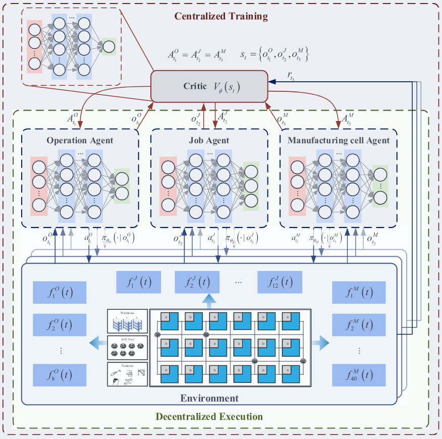
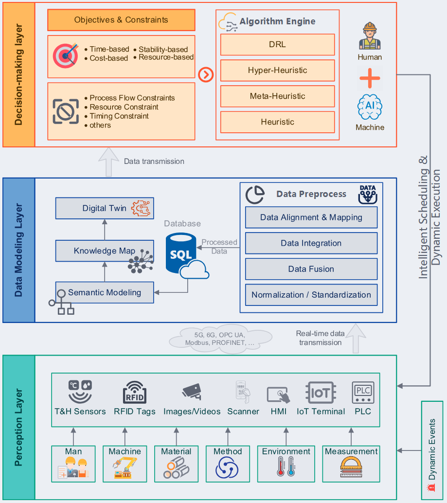
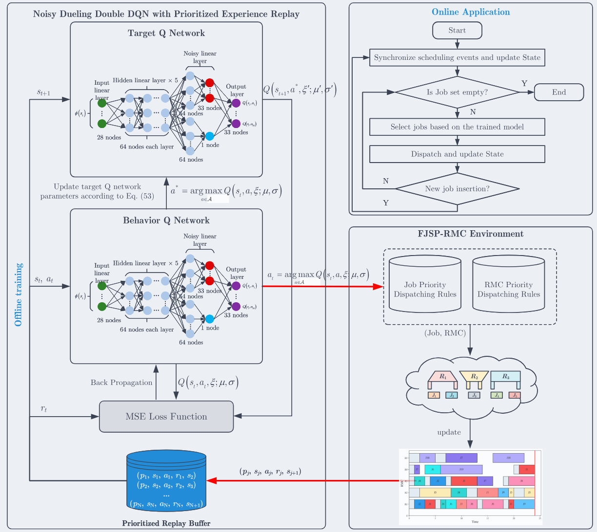
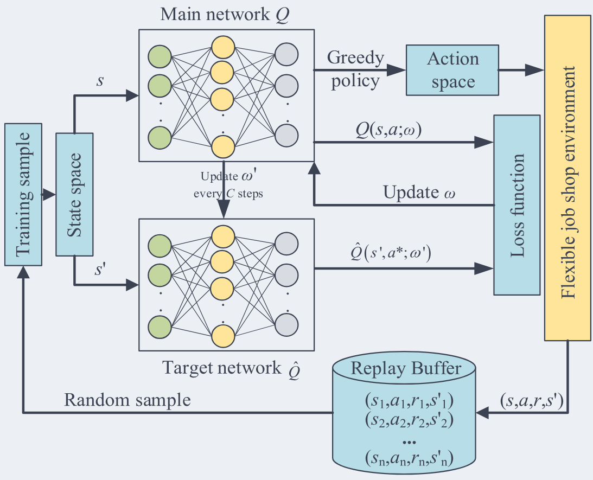








# Welcome!

I am currently a Ph.D. candidate in Mechanical Engineering at [Beijing Institute of Technology](https://english.bit.edu.cn/), Beijing. I am supervised by Assoc. Prof. Hao Gong and Research Fellow Cunbo Zhuang.

Before joining Beijing Institute of Technology, I received my M.S. and B.S. degrees in Mechanical Engineering from Hohai University, College of Mechanical and Electrical Engineering, Changzhou, China.

My research interests include production scheduling, combinatorial optimisation, deep reinforcement learning, smart manufacturing systems, and large language models. Currently, my research focuses on intelligent scheduling and management methods for reconfigurable manufacturing systems under dynamic and uncertain production environments.

[//]: # (You can find my CV here: [Liang Zheng's Curriculum Vitae]&#40;../assets/CV_Liang_Zheng.pdf&#41;. )
If you are interested in my work, please feel free to contact me by [email](mailto:liang.zheng@bit.edu.cn).

# 🔥 News

* **2026.03**:  One paper on real-time dynamic integrated process planning and scheduling with reconfigurable manufacturing cells accepted by *Journal of Manufacturing Systems*.
* **2026.03**:  One systematic review paper on dynamic shop floor scheduling in Industry 5.0 accepted by *Advanced Engineering Informatics*.

[//]: # (* **2025.12**:  Awarded the National Graduate Scholarship of China during Ph.D. study at Beijing Institute of Technology.)
* **2025.06**:  One paper on dynamic scheduling for flexible job-shop with reconfigurable manufacturing cells accepted by *International Journal of Production Research*.
* **2024.09**:  Started Ph.D. study in Mechanical Engineering at Beijing Institute of Technology.
* **2024.06**:  Received M.S. degree in Mechanical Engineering from Hohai University.

[//]: # (* **2021.06**:  Received B.S. degree in Mechanical Engineering from Hohai University.)

# 🔬 Research Interests

* Dynamic Production Scheduling
* Combinatorial Optimisation
* Deep Reinforcement Learning
* Smart Manufacturing Systems
* Large Language Models

# 📝 Publications

JMS 2026

[Real-time dynamic integrated process planning and scheduling with reconfigurable manufacturing cells via multi-agent reinforcement learning](https://doi.org/10.1016/j.jmsy.2026.01.004)

**Liang Zheng**, X. Chen, J. Liu, C. Zhuang

[**Project**](https://doi.org/10.1016/j.jmsy.2026.01.004) | <strong>SCI Journal Paper</strong>

* *Journal of Manufacturing Systems*, 85, 127–154, 2026. JCR Q1, IF 14.2.

AEI 2026

[Towards greater resilience: A systematic review of dynamic shop floor scheduling in Industry 5.0](https://doi.org/10.1016/j.aei.2025.104241)

**Liang Zheng**, Y. Cai, Q. Gao, J. Liu, C. Zhuang

[**Project**](https://doi.org/10.1016/j.aei.2025.104241) | <strong>SCI Journal Paper</strong>

* *Advanced Engineering Informatics*, 71, 104241, 2026. JCR Q1, IF 9.9.

IJPR 2025

[Dynamic scheduling for flexible job-shop with reconfigurable manufacturing cells considering dynamic job arrivals based on deep reinforcement learning](https://doi.org/10.1080/00207543.2025.2497961)

**Liang Zheng**, X. Chen, C. Zhuang, J. Liu, Y. Zhang, L. Lai

[**Project**](https://doi.org/10.1080/00207543.2025.2497961) | <strong>SCI Journal Paper</strong>

* *International Journal of Production Research*, 63(2), 7427–7459, 2025. JCR Q1, IF 7.3.

JIM 2025

[Research on flexible job shop scheduling problem with AGV using double DQN](https://doi.org/10.1007/s10845-023-02252-8)

M. Yuan, **Liang Zheng**, H. Huang, K. Zhou, F. Pei, W. Gu

[**Project**](https://doi.org/10.1007/s10845-023-02252-8) | <strong>SCI Journal Paper</strong>

* *Journal of Intelligent Manufacturing*, 36(1), 509–535, 2025. JCR Q1, IF 7.4.

* Y. Ming, **Liang Zheng**, J. Liu, C. Zhuang. Integrated process planning and scheduling with reconfigurable manufacturing cells through an improved dueling double deep Q-network algorithm. *Engineering Applications of Artificial Intelligence*, 172, 114370, 2026.
* M. Yuan, Q. Yu, **Liang Zheng**, S. Lu, F. Pei. Hierarchical collaborative scheduling of workers and AGVs for digital twin-based distributed flexible job shop. *Computers & Industrial Engineering*, 214, 111882, 2026.
* M. Yuan, S. Lu, **Liang Zheng**, Q. Yu, F. Pei, W. Gu. Distributed heterogeneous flexible job-shop scheduling problem considering automated guided vehicle transportation via improved deep Q network. *Swarm and Evolutionary Computation*, 94, 101902, 2025.

# 🎖 Honors and Awards

* *2025* National Graduate Scholarship of China, Ph.D. Program, Beijing Institute of Technology
* *2024* Second Prize, 21st Huawei Cup China Post-Graduate Mathematical Contest in Modeling, Beijing Institute of Technology
* *2024* Outstanding Graduate, Hohai University
* *2023* National Graduate Scholarship of China, Master’s Program, Hohai University
* *2021–2023* First-Class Academic Scholarship for Master’s Students, Hohai University

# 📖 Educations

* *2024.09 - 2028.06 expected*, Ph.D. Candidate in Mechanical Engineering, Beijing Institute of Technology, Zhuhai, China

  * Supervisors: Assoc. Prof. Hao Gong and Research Fellow Cunbo Zhuang

* *2021.09 - 2024.06*, M.S. in Mechanical Engineering, Hohai University, Changzhou, China

  * Supervisor: Assoc. Prof. Minghai Yuan

* *2017.09 - 2021.06*, B.S. in Mechanical Engineering, Hohai University, Changzhou, China

[//]: # (# 💻 Research Projects)

[//]: # ()
[//]: # (

National Key R&D Program

)

[//]: # (
)

[//]: # ()
[//]: # (**Research on Matrix Reconfigurable Production Intelligent Management and Control Platform for Large-Scale Customization**)

[//]: # ()
[//]: # (Sub-project of the National Key R&D Program of China)

[//]: # ()
[//]: # (* Grant No. 2022YFB3306104)

[//]: # (* Role: Major Participant)

[//]: # (* Period: 2024–2025)

[//]: # (* Keywords: large-scale customization, reconfigurable production, intelligent scheduling, digital-physical fusion, smart manufacturing)

[//]: # ()
[//]: # (
)

[//]: # (
)

[//]: # ()
[//]: # (

Master's Research Project

)

[//]: # (
)

[//]: # ()
[//]: # (**Research on Data-Driven Predictive Maintenance and Disturbance Self-Healing Mechanisms in Intelligent Manufacturing Workshops**)

[//]: # ()
[//]: # (HHU Outstanding Master’s Thesis Cultivation Project)

[//]: # ()
[//]: # (* Role: Principal Investigator)

[//]: # (* Period: 2023–2024)

[//]: # (* Keywords: predictive maintenance, disturbance self-healing, intelligent manufacturing workshop)

[//]: # ()
[//]: # (
)

[//]: # (
)

# 📌 Intellectual Property

## Patents

* **Liang Zheng**, M. Yuan, Y. Li, et al. An Integrated Window–Balcony Device. Chinese invention patent, granted 2022. Patent No. ZL201911132917.6.
* F. Pei, **Liang Zheng**, K. Mao, et al. A Binocular Colour Recognition Method Incorporating a Learning Mechanism. Chinese invention patent, granted 2025. Patent No. ZL202111551887.X.
* F. Pei, K. Mao, **Liang Zheng**, et al. A Method for Evaluating the Operational Energy Consumption of Dual Six-Axis Industrial Robots. Chinese invention patent, granted 2024. Patent No. ZL202111559913.3.

## Software Copyrights

* M. Yuan, **Liang Zheng**, L. Zhang, et al. Digital Twin Shop-floor Management and Control System Software V1.0. Registration No. 2021SR1314178.
* M. Yuan, **Liang Zheng**, K. Mao, et al. Constant-Force Hanger Testing System Software V1.0. Registration No. 2024SR0010327.

---

  <i>Stay focused, keep learning, and build intelligent manufacturing systems with real-world impact.</i>

